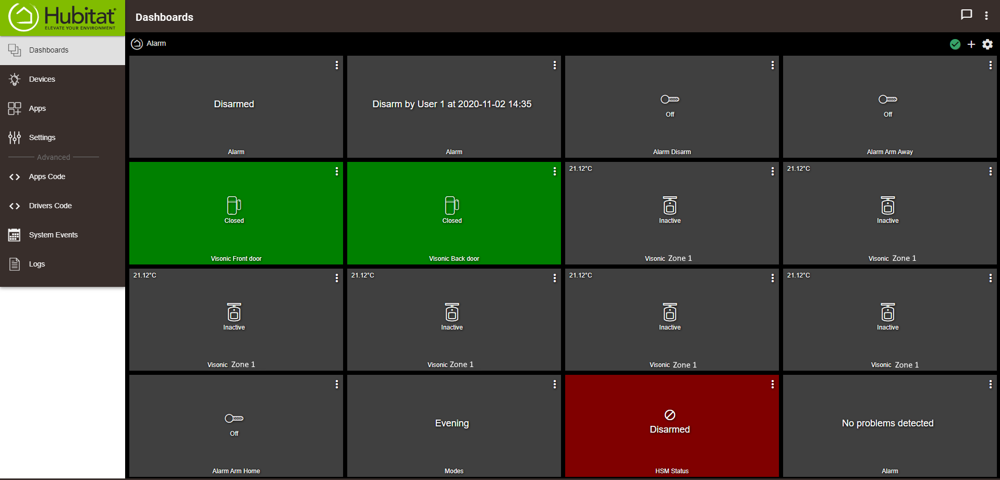

# Alarm Bridge Controller for Visonic, NetworX and Elk Alarm devices linked through an ESP bridge

## Overview
This code has been written to interface an ESP8266 based bridge into Hubitat. It will expose all zones, plus create child devices for them. It will also create child devices to arm/disarm the alarm (this is configurable in the settings). It also has several attributes so it is easy to pull alarm text into Hubitat Dashboards by using the 'Attribute' template. Some instructions are specific to the alarm that you are bridging.

## Some important points to note:
1) If you mess up the settings on your ESP (or need to change WiFi info...etc) then you can reset the device to default settings by power cycling 5 times with the device on for 1s per power cycle. The next boot it will begin broadcasting an access point again for configuration from scratch.
2) I strongly recommend giving your ESP a fixed IP address in your router config since otherwise you will need to update your settings whenever the IP changes (though there is now support for Static IP on the device - not as good as from the router)
3) I have created a custom inactvity motion timeout as some alarms give no notification that motion has stopped, this will default to 10s after every reboot, but you can configure it through the ESP dashboard.
4) If your Visonic Powermax is complaining about 'comms fail' and 'system trouble' after installing the Wemos then go into installer settings of the alarm and remove the ip address to send information to (make it 0.0.0.0). Then you need to disconnect the alarm power and its battery. After waiting for 30 seconds you can connect it back up and your alarm will no longer show an error message.
5) If you want to trigger an alarm on the Visonic alarms you will need some extra circuitry - described [here](https://github.com/cjcharles0/SmartThings/tree/master/VisonicAlarm/AlarmCircuitry)
7) If you have a very old Powermax+ or American style Powermax Pro, you might need to use an Arduino Nano in between the Powermax TX and the Wemos RX - this is because old Powermax devices seem to have very poor UART pins. You can find the full instructions for this step [here](https://github.com/cjcharles0/SmartThings/tree/master/VisonicAlarm/ArduinoFiles).
8) I strongly recommend using the Wemos for Visonic/serial integrations since it has the circuitry to step the voltage down to 3V3 and 5V onboard. If you use another power supply (e.g. USB with ground tied together), then the communication with the alarm is much less reliable, plus if you do not get a good power supply it can permanently damage your alarm.
9) If connecting to an MQTT broker rather than SmartThings then you can enter the details on the settings/advanced page (HA IP/port and user/pass which can sometimes be anything you like). When you enable MQTT mode it will disable this integration. The alarm status will be posted to topic:"alarm/panel" e.g. "disarmed" or "armed_away", meanwhile zone status will be posted to topic:"alarm/zoneX" for messages relating to zone1/zone2/... If you post to topic:"alarm/set" then you can change the alarm status to DISARM/ARM_HOME/ARM_AWAY/ARM_HOME_INSTANT/ARM_AWAY_INSTANT.
9) For those wanting to donate then my beer fund would gladly appreciate it :) - https://paypal.me/cjcharles

## Installation Instructions
If you are migrating from ST you can jump to step 6.

1) Turn on the ESP by plugging into Micro USB (do not use Micro USB when connecting to a serial alarm like Visonic) and you will see a WiFi Access Point created, called "AlarmPanelBridge" (it might take a minute to appear). Connect to this access point (no password needed) and navigate to 192.168.4.1 (should be automatic on most phones if you try and use the access point for browsing). On the page that appears, you should select your own WiFi network (2.4GHz only) by choosing from the menus and adding your password.

2) After this is complete you should see the ESP connect to your router (and should even be visible from within Windows as a Network device under the 'Network' view. Update the router so that this device is always given the same IP address, this is called a DHCP reservation - without it you may find things stop working after IP addresses change. It may take some time for the router to detect the Wemos, but if you cannot see the AlarmPanelBridge access point then the Wemos should be connected to your WiFi (it broadcasts its access point when a connection to your entered WiFi details is not possible).

3) Navigate to the IP address that the ESP has been given (take note of it) and you should see a simple dashboard. Take note of the MAC address listed on this page (it is a string of 12 letters and numbers). 

Now continue with Step 4 for Visonic alarms or Step 5 for others:

4a) If you are interfacing with a Visonic alarm ten you can now disconnect the usb power and connect to the Powermax alarm for comms and power.
**IMPORTANT: USB power is _NOT_ recommended when isntalling the Wemos into the Visonic alarm, it is likely to permanently damage your alarm!!!**

4b) Connect the Wemos to the Powermax alarm. You need four connections: Power, Ground, RX and TX (RX on the Visonic Alarm Panel goes to TX on the Wemos and vice versa). The image below shows the connections between Wemos and Powermax, this pin header should be identical on all Powermax panels. I use 12V since it is easy to get from inside the alarm, plugs into the barrel connector of the Wemos quickly and easily, plus there is lots of spare 12V capacity from the onboard voltage regulators. If using anything else (e.g. 5V) then ensure it is within spec of the Wemos Vin and beware that it may place a strain on the Powermax 5V regulators, though unlikely to cause a problem. (3.75V is also available inside the alarm but I strongly recommend against using it, since it is outside of Wemos specification and the voltage regulator is unlikely to be strong enough). If you have a USA version Powermax Pro, or UK version Powermax+ then you will need to install an Arduino between the Wemos and Powermax ( [More details here]( https://github.com/cjcharles0/SmartThings/tree/master/VisonicAlarm/ArduinoFiles) ). If you have a Powermax Express with an AC power supply then you will need to see here for finding the easiest place to get a [DC power supply.](https://github.com/cjcharles0/SmartThings/tree/master/VisonicAlarm/PowermaxExpress)

4c) Check the ESP/Wemos is talking to the Powermax alarm by visiting the IP address of the ESP again and clicking on 'Alarm status' under the JSON endpoint section. You should see the status at the top of the Status page saying disconnected, eventually it should say disarmed and then finally it will show the zones at the bottom of the JSON. If you do not see your zone names in the JSON (as defined in Powermax) then the Wemos has not paired with your Powermax board. The Wemos will auto enroll on Powermax Complete (can take 5 minutes), but on other alarms you will need to force the enroll by going into the Powermax Installer Mode and choosing 'Enroll Powerlink' (again please allow 5 minutes). If you are struggling to get this to work, then try resetting the Wemos by pressing the small button (or disconnecting power) and then waiting again. It can sometimes take a few repeats of this for it to enrol - and can take 5 minutes from turning on. If you are still struggling at this point, now is the time to change the pin from default 3622 to your user PIN, then leave it another 10 minutes with a few restarts. If you are still struggling at this point, now is the time to change the pin from default 3622 to 5650, and then to your master installer PIN, leave it another 10 minutes with a few restarts after each change. One of these should allow you to successfully connect to the alarm, if not then you might need to use listen only mode (which supports most features but you will not get zone names out of the alarm) - The ST forums are a good place to discuss how this should be used.

4d) You should now be able to press Disarm/ArmHome/ArmAway on the Wemos webpage and you should hear your alarm respond! You should also see the full status page with alarm status, pin codes and zone names. Anything not working at this stage will not improve with the following SmartThings steps. If you can arm but not disarm, then the Wemos is able to talk to the Powermax but it cannot enrol successfully, hence you will need to keep trying on step 8, or discuss on the [forum](https://community.smartthings.com/t/release-visonic-powermax-alarm/84119)

5) Set up your (non-Visonic) ESP based device so that it can control your alarm from its webpage control panel. Once you can control the alarm (and see status information) you can now proceed to the following steps.

6) Install the Device Handlers into Hubitat through Package Manager (or individually install the two device handlers in this folder). Copy from raw and paste as code into your Hubitat dashboard, nothing else should need to be changed at this stage.

7) Create a new virtual device in Hubitat (top of the Devices page) and give it a name of your choosing (E.g. Alarm panel). Set the Network ID (DNI) to be the MAC address of the ESP bridge that you copied from step 3 (this should be entered in capital letters and without colons i.e. AABBCCDDEEFF). Ensure it uses the Device Handler called 'Alarm Bridge' and press Save.

8) Now you open the Device page for your new virtual device (Alarm panel) in the Hubitat dashboard and add the configuration/preferences information. Add the IP address of the ESP bridge, configure the settings about HSM sync and child devices (I recommend both being enabled), add a Pre and/or Post name in the settings (e.g. putting Zone in PreName means that all created zones will have Zone added at the start of them - this will make them easier to identify in your device list). I suggest not changing the inactivity timeout yet. Press save on these settings/preferences.

9) Now at the top of the same page you can press 'Refresh' and 'Configure' - this should populate some basic information and tell the ESP the address of your Hubitat hub (you should see some information appear on the right of the screen). Now you can press "Create Zone Devices" and it will create child devices for each zone (and extra's for alarm control if you enabled that option in the settings page).

10) You should finally have a fully linked Alarm inside Hubitat and have child devices for zone status and controlling the different arm states (plus attributes to see useful alarm information such as problems and alarm status)
