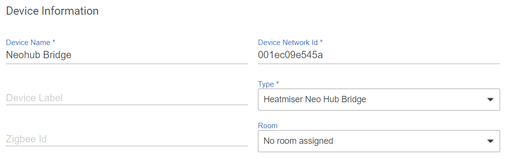
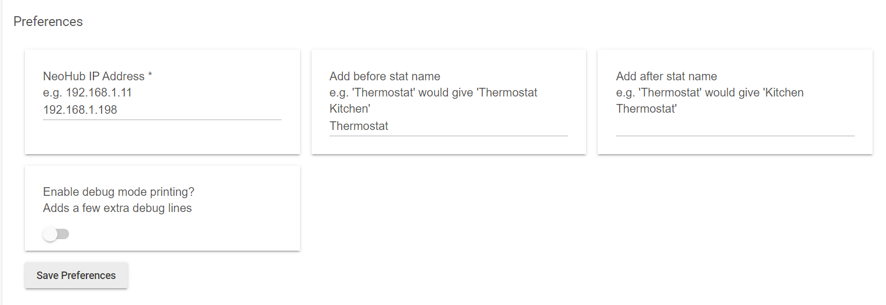

# Heatmiser Neo Integration (All Neo devices, including thermostats, plugs and hot water)

## Overview
This integration links the Heatmiser Neohub to Hubitat and allows you to create automated rules for controlling your thermostats.

## Installation Instructions
1) Install the device handlers in this folder (either from this page or it is very easy through Hubitat Package Manager). You only need the 'Plug' device handler if you have a thermostat or plug to control.

2) Add a virtual device to Hubitat using the NeoHub device handler. I recommend ensuring the Device Network ID matches the MAC address of the Neohub since eventually this might remove the need for polling - though at the moment this is optional.

3) Set the IP address of your Neohub in the settings for the bridge device, and I suggest adding 'Thermostat' in the before/after text boxes so that the child thermostats are created with clear names. After pressing Save preferences you can press 'Refresh' and 'Get thermostats' to create all required child device for each thermostat/plug/... that you have configured in your Neohub.
4) Enjoy automated heating now that you can change your heating through Hubitat rules.
